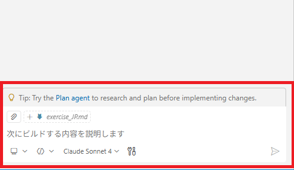

# 演習 1: GitHub Copilot Agentモードでのカスタム指示ファイル作成

| [← 前の手順](./0-prereqs.md) | [次の手順: ブループリントプロンプト →](./2-blueprint-instructions.md) |
|:--|--:|

GitHub Copilot Agentモードを使用して、Spring Boot PetClinicプロジェクト用のカスタム指示ファイルを作成します。この指示ファイルにより、Copilotがプロジェクト固有のベストプラクティスに従ったコードとドキュメントを生成できるようになります。

## シナリオ

開発チームの新しいメンバーとして、既存のSpring Boot PetClinicプロジェクトのコーディング標準とアーキテクチャパターンを理解し、それをCopilotに教育する必要があります。まずは標準的なAgent機能を使用して基本的なカスタム指示ファイルを作成し、プロジェクトの技術スタックとコーディング規約を把握します。

## ? 必須 1. GitHub Copilot Chatの起動

### 1.1 Copilot Chatビューの開始

1. VS Codeの右サイドバーにあるチャットアイコンをクリックします
   
2. または、キーボードショートカットを使用します：
   - Windows/Linux: `Ctrl+Alt+I`
   - Mac: `Cmd+Option+I`
3. Copilot Chatビューが開いていることを確認します
   

### 1.2 プロジェクト認識の確認

1. Copilot Chatに以下のメッセージを入力して、プロジェクトが正しく認識されていることを確認します：
   ```
   現在のワークスペースのプロジェクト構成を教えてください
   ```
2. Spring Boot PetClinicプロジェクトの主要コンポーネントが認識されていることを確認します

## ? 必須 2. カスタム指示ファイルの生成

### 2.1 Agent用プロンプトの実行

1. Copilot Chatに以下のプロンプトを入力して実行します：

```
このSpring Boot PetClinicプロジェクトを分析して、`.github/agent-copilot-instructions.md`を生成してください。

含めるべき要素：
- 技術スタック（Spring Boot 3.5.0、Java 17、JPA）の検出
- レイヤードアーキテクチャルール（Controller/Service/Repository）
- コード品質標準（Javadoc、Spring Format）
- JPAエンティティ設計パターン（BaseEntity継承）
- 禁止事項と推奨事項
```

### 2.2 生成結果の確認

1. Copilotが生成した指示ファイルの内容を確認します
2. 以下の要素が含まれていることを確認します：
   - プロジェクトの技術スタック情報
   - アーキテクチャのレイヤー分けルール
   - コードフォーマット規則
   - エンティティ設計パターン

3. ファイルを保存します

## ? 参考 3. 生成された指示ファイルの内容分析

### 3.1 技術スタック検出の確認

生成された指示ファイルで以下の技術情報が正しく検出されているか確認します：
- Spring Boot バージョン
- Java バージョン
- 使用されているSpringモジュール（Web、Data JPA、Thymeleafなど）
- データベース設定（H2、MySQL、PostgreSQL対応）

### 3.2 アーキテクチャルールの確認

以下のアーキテクチャパターンが記載されているか確認します：
- Controller層の責任範囲
- Service層の実装推奨事項
- Repository層のJPAパターン
- エンティティクラスの設計規約

## ? オプション 4. 指示ファイルのカスタマイズ

### 4.1 プロジェクト固有ルールの追加

生成された指示ファイルに以下のプロジェクト固有ルールを追加することを検討します：
1. チーム特有の命名規約
2. 特定のライブラリ使用制限
3. セキュリティ要件
4. パフォーマンス考慮事項

### 4.2 禁止事項の明確化

以下のような項目を禁止事項として明記します：
- Controller層での直接的なDB操作
- ビジネスロジックのView層への配置
- 非推奨APIの使用

## ?? トラブルシューティング

### 問題が発生した場合

1. **指示ファイルが生成されない場合**
   - ワークスペースが正しくSpring Bootプロジェクトを認識していることを確認
   - プロンプトを再実行
   - 新しいチャットセッションを開始して再試行

2. **生成内容が不十分な場合**
   - より具体的な要求を含む追加プロンプトを実行
   - プロジェクトファイルの詳細分析を要求

3. **技術スタックが正しく検出されない場合**
   - `pom.xml`または`build.gradle`ファイルが正しく配置されていることを確認
   - プロジェクトのルートフォルダーをVS Codeで開いていることを確認

### デバッグ用プロンプト

問題が発生した場合、以下のデバッグ用プロンプトを試してください：
```
現在のプロジェクトの依存関係とSpringコンポーネントを詳細に分析してください
```

## まとめと次のステップ

この演習で以下を実現しました：

- GitHub Copilot Agentモードの基本的な使用方法を習得
- Spring Boot PetClinicプロジェクトの技術スタックを自動分析
- 基本的なカスタム指示ファイルを生成
- プロジェクト固有のコーディング規約を文書化

次のステップでは、より高度なブループリントプロンプトを使用して、同じプロジェクトからより詳細で実用的な指示ファイルを生成します。この比較により、異なるアプローチの特徴と効果的な使い分けについて理解を深めます。

## リソース

- [GitHub Copilot Agents Documentation](https://docs.github.com/en/copilot/using-github-copilot/using-github-copilot-agents)
- [Custom Instructions Best Practices](https://docs.github.com/en/copilot/customizing-copilot/adding-custom-instructions-for-github-copilot)
- [Spring Boot Documentation](https://spring.io/projects/spring-boot)

---

| [← 前の手順](./0-prereqs.md) | [次の手順: ブループリントプロンプト →](./2-blueprint-instructions.md) |
|:--|--:|