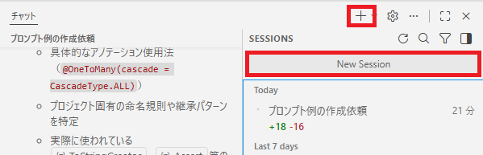

# 演習 2: ブループリントプロンプトを使用したカスタム指示ファイルの生成

| [← 前の手順](./1-agent-instructions.md) | [次の手順: 指示ファイルの比較 →](./3-comparison.md) |
|:--|--:|

より高度なブループリントプロンプト機能を使用して、Spring Boot PetClinicプロジェクト用のより詳細で実用的なカスタム指示ファイルを生成します。この機能により、プロジェクトの深い分析と具体的なコード例を含む包括的な指示を作成できます。

## シナリオ

前の演習で作成した基本的なカスタム指示ファイルでは、一般的なルールや概念的な説明にとどまっていました。実際の開発現場では、より具体的でプロジェクト固有の詳細な指示が必要です。ブループリントプロンプトを使用することで、実際のコードパターンを分析し、具体的なコード例を含んだより実用的な指示ファイルを生成できます。

## ? 必須 1. 新しいChatセッションの開始

### 1.1 新しいセッションの作成

1. Copilot Chatビューの右上にある「＋」アイコンまたは「New Session」ボタンをクリックします
   
2. 新しいチャットセッションが開始されたことを確認します
3. 前のセッションの影響を受けないクリーンな状態であることを確認します

### 1.2 セッション分離の重要性

新しいセッションを使用する理由：
- 前回の指示やコンテキストの影響を排除
- ブループリントプロンプトの機能を最大限活用
- 異なるアプローチでの分析結果の比較を可能にする

## ? 必須 2. ブループリントプロンプトの実行

### 2.1 高度なプロンプトの実行

1. 新しいCopilot Chatセッションに以下のブループリントプロンプトを入力します：

```
/copilot-instructions-blueprint-generator

このSpring Boot PetClinicプロジェクトを分析して、`.github/prompt-copilot-instructions.md`を生成してください。

含めるべき要素：
- 技術スタック（Spring Boot 3.5.0、Java 17、JPA）の検出
- レイヤードアーキテクチャルール（Controller/Service/Repository）
- コード品質標準（Javadoc、Spring Format）
- JPAエンティティ設計パターン（BaseEntity継承）
- 禁止事項と推奨事項
```

### 2.2 ブループリント機能の特徴

ブループリントプロンプト（`/copilot-instructions-blueprint-generator`）の利点：
- **深いコード分析**: 実際のコード構造とパターンを詳細に分析
- **具体的な例**: 抽象的なルールではなく、具体的なコード例を提供
- **プロジェクト固有の検出**: 実際に使用されているライブラリやパターンを検出
- **実装レベルの詳細**: メソッドレベル、アノテーションレベルの仕様を含む

### 2.3 生成プロセスの観察

1. Copilotがプロジェクトファイルを分析している過程を観察します
2. 複数のファイルを横断した分析が行われていることを確認します
3. 生成にかかる時間が前回より長い可能性があります（詳細分析のため）

## ? 必須 3. 生成結果の詳細確認

### 3.1 高度な分析結果の確認

生成された指示ファイルで以下の詳細項目が含まれていることを確認します：

1. **具体的なコード例**:
   - `@OneToMany(cascade = CascadeType.ALL)`のような具体的なアノテーション
   - `ToStringCreator`の使用パターン
   - Bean Validationの詳細仕様（`@Pattern`など）

2. **プロジェクト固有パターンの検出**:
   - `BaseEntity`と`NamedEntity`の継承パターン
   - `Person`クラスの具体的な実装方法
   - プロジェクト特有の命名規則（例：`OwnerController`）

### 3.2 禁止事項の具体化

以下のような具体的な禁止事項が含まれているか確認します：
- Controller層での`@Transactional`アノテーション使用禁止
- Service層を経由しないRepository直接アクセスの禁止
- 具体的なアンチパターンの例示

## ? 参考 4. ブループリント分析の詳細理解

### 4.1 検出されたパターンの分析

生成された指示ファイルから以下のパターンを特定します：
1. **エンティティ設計**:
   ```java
   // 検出された例
   public class Owner extends Person {
       // BaseEntity → NamedEntity → Person → Owner の継承チェーン
   }
   ```

2. **Repository パターン**:
   ```java
   // 検出された例
   public interface OwnerRepository extends Repository<Owner, Integer> {
       // Springの標準リポジトリパターン
   }
   ```

### 4.2 コード品質基準の詳細化

以下の品質基準が具体的に記載されていることを確認します：
- Javadocの記述パターン
- Bean Validationの使用方法
- エラーハンドリングのパターン
- テスト作成時の考慮事項

## ? オプション 5. カスタマイズと拡張

### 5.1 生成結果の微調整

1. 生成された指示ファイルをレビューし、以下を検討します：
   - チーム固有のルールの追加
   - セキュリティ要件の強化
   - パフォーマンス指標の追加

### 5.2 バリデーションルールの追加

```
この指示ファイルに以下のバリデーションルールも追加してください：
- データベーストランザクション管理のベストプラクティス
- 例外処理のパターン
- ログ出力の標準化
```

## ?? トラブルシューティング

### 問題が発生した場合

1. **ブループリントコマンドが認識されない場合**
   - Copilot Chatの拡張機能が最新版であることを確認
   - VS Codeの再起動を試行
   - コマンドの正確な記述を確認（`/copilot-instructions-blueprint-generator`）

2. **分析が不十分な場合**
   - プロジェクトの主要ファイルが存在することを確認
   - 追加の詳細分析を要求する追加プロンプトを実行

3. **生成に時間がかかる場合**
   - 大規模なプロジェクト分析には時間がかかることは正常
   - しばらく待機してから結果を確認

### デバッグ用プロンプト

問題が発生した場合の追加分析用プロンプト：
```
プロジェクトの主要なJavaクラスファイルを詳細に分析し、使用されているSpringアノテーションと設計パターンを列挙してください
```

## まとめと次のステップ

この演習で以下を実現しました：

- ブループリントプロンプトの使用方法を習得
- プロジェクトの深い分析による詳細な指示ファイルの生成
- 具体的なコード例を含む実用的なガイドライン作成
- プロジェクト固有パターンの自動検出と文書化

次のステップでは、演習1で作成した基本的な指示ファイルと、この演習で作成した詳細な指示ファイルを比較分析します。これにより、異なるアプローチの特徴と適用場面を理解し、最適な手法選択ができるようになります。

## リソース

- [Blueprint Prompts Documentation](https://docs.github.com/en/copilot/using-github-copilot/using-copilot-agents/using-blueprint-prompts)
- [Advanced Copilot Instructions](https://docs.github.com/en/copilot/customizing-copilot/adding-custom-instructions-for-github-copilot)
- [Spring Boot Best Practices](https://spring.io/guides/gs/spring-boot/)

---

| [← 前の手順](./1-agent-instructions.md) | [次の手順: 指示ファイルの比較 →](./3-comparison.md) |
|:--|--:|